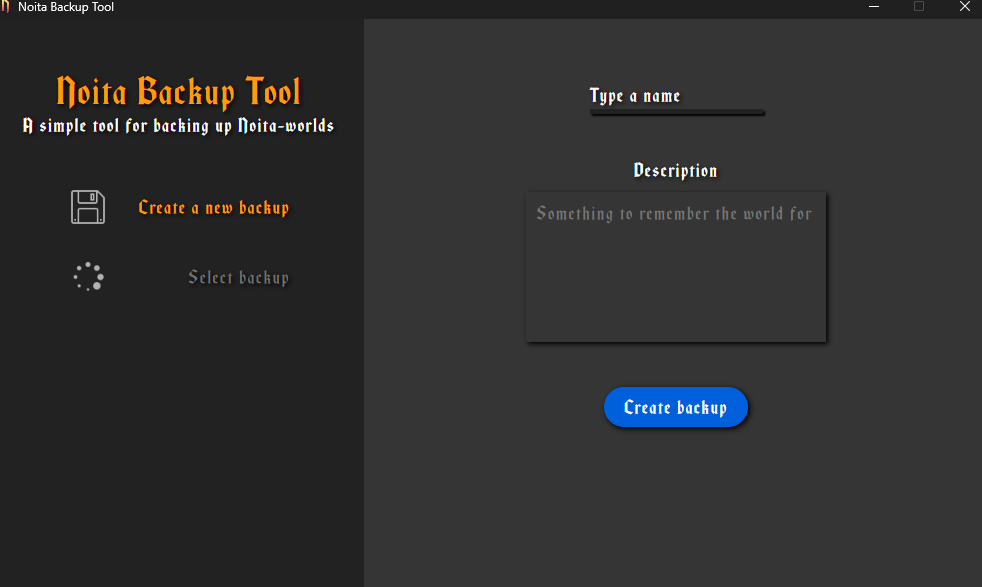
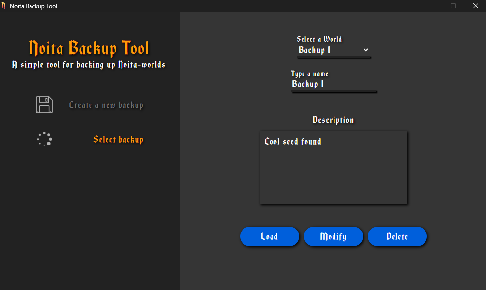

# NoitaSaveBackupper
Using this tool you can backup your noita wolrds with ease. You can also load old backups.
___

## How to install
### Requirements
1. The game "Noita"
2. Node
3. Python3

### Installation
1. Run "npm install"
2. Run "pip install -r requirements.txt"
3. Run main.py

## How to use
### Main view
  
Here you only need to type a name and a description for you backup, then press "Create Backup".  
Afterwards you can go to "Select backup" -page and load, modify and remove backups 

### Selection view
  
Here you can select a backup and then:
1. Modify it by changing it's description and pressing "Modify"
2. Load it. NOTE: this will overwrite the current world!
3. Delete it.